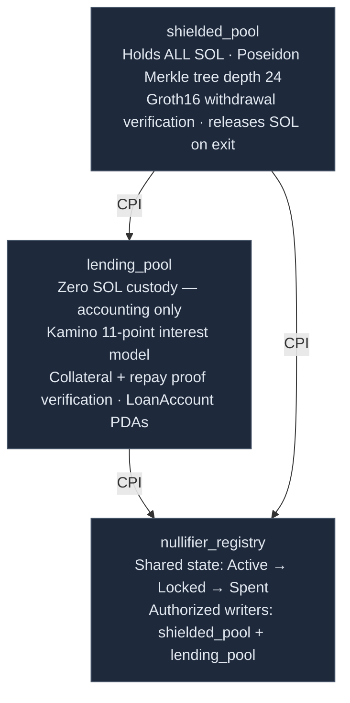

# ShieldLend — Privacy-First Lending Protocol on Solana

A zero-knowledge, privacy-preserving lending protocol on Solana. Deposits are unlinkable to wallets, withdrawal destinations are one-time addresses, repayment settlement can use private payments, oracle data is encrypted against MEV, and the signing infrastructure has no single operator key.

Built for the **Colosseum Frontier Hackathon 2026**.

---

## The Problem

On-chain lending has a fundamental privacy problem — and it is not just about hiding amounts.

Every interaction with a lending protocol creates a permanent, public record that an observer can use to build a profile of a user:

| Observable data | What it reveals |
|---|---|
| Deposit transaction | Depositor's wallet, amount, and timing |
| Loan disbursement | Borrower's wallet, loan size, and collateral |
| Repayment transaction | Confirmation that a wallet is a borrower |
| Withdrawal | Links the depositor's wallet to a withdrawal destination |

This matters for individuals who want financial privacy, for institutions that cannot reveal their treasury positions on-chain, and for anyone whose on-chain credit history should not be public record.

Existing privacy tools address one layer at a time: mixers hide amounts but not lending state; stealth addresses hide destinations but not deposits; ZK proofs hide which commitment was spent but not who submitted the transaction. ShieldLend combines these layers across the full transaction lifecycle.

---

## Design Philosophy

Privacy in DeFi is not a feature — it is a stack.

ShieldLend applies sequential protections across the transaction lifecycle. Each protection closes a specific gap that no other component addresses:

- **Entry protection** (MagicBlock PER + VRF): Deposits execute inside an Intel TDX enclave. Multiple users' deposits batch before any commitment reaches the Merkle tree — no observer can link a wallet to a specific commitment. VRF generates dummy commitments that are indistinguishable from real ones, permanently expanding the anonymity set for all future ring proofs.

- **Relay protection** (IKA dWallet): Every on-chain operation — deposit, withdrawal, borrow, repay — is submitted by the IKA relay wallet, not the user's wallet. The relay is a 2PC-MPC dWallet: no single key exists. Both the user and the IKA MPC network must participate to authorize any relay operation. All exits (withdrawals and borrow disbursements) route through the same relay → PER batch → stealth path, making their type indistinguishable on-chain.

- **State protection** (Encrypt FHE): Oracle price feeds for health factor computation are submitted as FHE ciphertexts. MEV bots cannot compute liquidation trigger conditions from encrypted mempool data. Aggregate solvency is tracked through encrypted collateral coverage and public/bucketed debt accounting without revealing individual collateral positions.

- **Payment protection** (MagicBlock Private Payments): Repayments settle through a private SPL/WSOL payment path. The LendingPool verifies a receipt bound to `loanId`, `nullifierHash`, and `outstanding_balance`, so collateral can unlock without publishing the repayment transfer graph.

- **Exit protection** (Umbra SDK): Every output — withdrawal destinations and loan disbursements — routes to a one-time Umbra stealth address. Each address is derived via ECDH from the recipient's published meta-address, has zero prior chain history, and is abandoned after use.

---

## Current Build Status

> **Pre-alpha scaffold — as of 2026-05-04.**  
> All three Anchor programs compile (`cargo check`). No programs are deployed. ZK artifacts are stale.
> All program IDs are placeholders. 8 Rust unit tests pass locally. No Anchor integration tests (all `it.skip`).
> Do not use this codebase to claim any privacy property is live.

| Component | Status | Notes |
|---|---|---|
| `circuits/withdraw_ring.circom` | Written — not compiled | Nullifier formula update required before recompile |
| `circuits/collateral_ring.circom` | Written — not compiled | Same nullifier update required |
| `circuits/repay_ring.circom` | Written — not compiled | No ZK artifacts generated |
| `frontend/public/circuits/*.wasm` | Stale | Predate `leaf_index` update; must be deleted and recompiled |
| `frontend/public/circuits/*.zkey` | Missing | No `.zkey` or `_vkey.json` files exist anywhere in repo |
| `frontend/src/lib/circuits.ts` | Done | snarkjs Groth16 proof pipeline ready; inert without real artifacts |
| `frontend/src/lib/noteStorage.ts` | Done | AES-256-GCM + HKDF note vault — cryptographically sound |
| `frontend/src/lib/history.ts` | Done | AES-256-GCM encrypted history log (vault key required) |
| `programs/shielded_pool/` | Scaffolded — not deployed | Deposit queues SOL; withdraw/disburse fail-closed |
| `programs/lending_pool/` | Scaffolded — not deployed | Interest accrual correct; borrow/repay fail-closed |
| `programs/nullifier_registry/` | Scaffolded — not deployed | State machine correct; CPI wiring absent |
| Cross-program CPIs | Not implemented | No CPI between any of the three programs |
| `groth16-solana` dependency | Not added | Not in `Cargo.toml`; all verifiers return errors |
| IKA dWallet relay | Not wired | User wallet is the on-chain signer for every deposit |
| MagicBlock PER | Not wired | No `#[ephemeral]`/`#[delegate]`/`#[commit]` macros in any program |
| Umbra SDK | Not installed | Not in `package.json`; stealth address field is a free Pubkey |
| Anchor integration tests | Scaffolded — all skipped | 9 × `it.skip` |
| Rust unit tests | Active | 8 categories pass locally with `cargo test --workspace` |

---

## Protocol Selection

Every protocol in ShieldLend's stack was chosen to close a specific privacy gap that no other tool addressed. The design started from privacy requirements and worked backwards to protocols — not the other way around.

The component-to-protocol mapping tables below show this gap → choice relationship for every function in the protocol. For the full decision rationale (alternatives considered, tradeoffs evaluated), see [`docs/DESIGN_DECISIONS.md`](docs/DESIGN_DECISIONS.md).

---

## Architecture

### Programs

ShieldLend is three Anchor programs. All SOL stays in one place. The other two programs only keep state.



For the full transaction lifecycle -- how deposit connects to withdraw, borrow, repay, and liquidate -- see [`docs/VISUAL_FLOWS.md`](docs/VISUAL_FLOWS.md).

---

### Privacy Architecture

Each layer closes a different gap in the lending lifecycle:

| Layer | What it does | Why it is needed |
|---|---|---|
| IKA dWallet | Submits protocol actions without exposing the user's main wallet as signer. | Prevents deposit, withdraw, borrow, and repay instructions from becoming wallet-linked credit events. |
| MagicBlock PER | Batches deposits and exits inside a private execution environment. | Breaks timing correlation and makes withdrawal exits and borrow disbursement exits harder to classify. |
| Groth16 circuits | Prove note ownership, collateral validity, and repayment authority. | Lets the protocol enforce rules without revealing which note belongs to the user. |
| MagicBlock Private Payments | Settles repayments through a private payment receipt in Full Privacy mode. | A ZK proof alone cannot hide a normal public repayment transfer. |
| Encrypt FHE | Keeps oracle and health-factor computation encrypted until authorized reveal. | Protects liquidation-sensitive data from MEV and public health-factor surveillance. |
| Umbra | Gives each withdrawal or disbursement a fresh stealth receiving address. | Prevents outputs from landing directly in a known wallet. |
| NullifierRegistry | Tracks Active, Locked, and Spent note states. | Prevents double-spend and prevents collateral withdrawal during active loans. |

The canonical explanation of these flows is [`docs/VISUAL_FLOWS.md`](docs/VISUAL_FLOWS.md). The exact privacy guarantees, residual risks, and adversary model are in [`docs/PRIVACY_AND_THREAT_MODEL.md`](docs/PRIVACY_AND_THREAT_MODEL.md).

---

## Privacy Status

> **Audit result (2026-05-04):** The properties below have been independently audited. Claims marked
> `[NOT IMPLEMENTED]` are false in the current codebase and must not be stated in demos or submissions
> until the corresponding blocker is resolved. See `audit-reports/FINAL_AUDIT_REPORT.md` for full findings.

```
PROPERTY                                STATUS              NOTES
────────────────────────────────────────────────────────────────────────────────────────
Depositor wallet hidden                 [NOT IMPLEMENTED]   User wallet IS the on-chain relay signer
                                                            (solanaClient.ts:109). IKA not wired.
Deposit timing correlation broken       [NOT IMPLEMENTED]   No PER macros in any program; no batching.
Anonymity set ≥ 8 real (min batch)      [NOT IMPLEMENTED]   Depends on PER — not wired.
VRF dummies indistinguishable           [NOT IMPLEMENTED]   VRF proof not verified; no dummy insertion logic.
Root tolerance (offline users)          ✓ — designed        30 historical roots retained (lib.rs:240–242).
Which commitment was spent              [NOT IMPLEMENTED]   Ring decoys are integers 2–16; anonymity set = 1.
Cross-contract nullifier unlinkability  [NOT IMPLEMENTED]   Domain separator is placeholder 13 in all circuits.
Re-insertion double-spend prevention    [NOT IMPLEMENTED]   No CPI from withdraw/borrow/repay to registry.
Withdrawal submitter wallet hidden      [NOT IMPLEMENTED]   Depends on IKA relay — not wired.
Withdrawal destination hidden           [NOT IMPLEMENTED]   Umbra SDK not in package.json; no code exists.
Borrow vs withdrawal exit               [NOT IMPLEMENTED]   ExitKind stored publicly in QueuedExit on-chain.
Which collateral note is locked         ✓ — designed        Collateral ring proof structure correct.
Borrower wallet hidden                  [NOT IMPLEMENTED]   Depends on IKA relay — not wired.
Disbursement destination hidden         [NOT IMPLEMENTED]   Umbra not installed; lending_pool_authority
                                                            unconstrained (any signer accepted).
Repayment amount hidden                 [NOT IMPLEMENTED]   MagicBlock Private Payments not integrated.
Repayer wallet hidden                   [NOT IMPLEMENTED]   Depends on IKA relay — not wired.
Oracle price (liquidation MEV)          [NOT IMPLEMENTED]   Encrypt verifier returns error; no FHE ciphertext.
FHE liquidation handle replay           ✓ — designed        ciphertext_handle field exists (fix for binding
                                                            check needed before deployment — audit C-06).
Stale liquidation on healthy position   ✓ — designed        Consecutive breach guard (count ≥ 2) in place.
Individual collateral values            [NOT IMPLEMENTED]   borrow_amount is plaintext; no FHE ciphertexts.
Who was liquidated                      [NOT IMPLEMENTED]   Depends on IKA relay — not wired.
Single operator key risk eliminated     [NOT IMPLEMENTED]   No IKA call in any program or API route.
Liquidation trust via IKA FutureSign    [NOT IMPLEMENTED]   future_sign_authorized is a borrower-supplied
                                                            boolean (lending_pool/src/lib.rs:52).
Double-spend prevention                 [NOT IMPLEMENTED]   NullifierRegistry CPI absent from all callers.
────────────────────────────────────────────────────────────────────────────────────────
Note vault encryption (local)           ✓ — implemented     AES-256-GCM + HKDF, wallet-derived key.
History log encryption (local)          ✓ — implemented     AES-256-GCM, same vault key.
Fixed denominations enforced on-chain   ✓ — designed        0.1 / 1 / 10 SOL (lib.rs:142–148).
Borrow amount                           public/bucketed     Required for deterministic LTV mechanics.
That a borrow occurred                  public              LoanAccount PDA creation is visible.
Aggregate collateral coverage           disclosed           Threshold decrypt aggregate only (planned).
IP address visible to relay             not covered         Tor/VPN at application layer — user responsibility.
────────────────────────────────────────────────────────────────────────────────────────
```

---

## Funds and Accounting

SOL flows:
- **Deposit**: IKA relay → ShieldedPool (via PER batch)
- **Withdraw**: ShieldedPool → IKA relay → PER exit batch → Umbra stealth address
- **Borrow**: ShieldedPool → IKA relay → PER exit batch → Umbra stealth address (same path as withdraw)
- **Repay**: MagicBlock Private Payments → repayment vault/private balance; IKA relay submits proof + receipt; LendingPool clears loan PDA

---

## ZK Circuits

All circuits produce Groth16 proofs verified on-chain by `groth16-solana`.

| Circuit | Status | Proves | Public inputs/outputs |
|---|---|---|---|
| `withdraw_ring.circom` | Done (update required)* | Ring membership (K=16) + Merkle inclusion at `leaf_index` (depth 24) | `ring[16]`, `nullifierHash`, `root`, `denomination_out` |
| `collateral_ring.circom` | Done (update required)* | Ring membership + `denomination × minRatioBps ≥ borrowed × 10000` | `ring[16]`, `nullifierHash`, `root`, `borrowed`, `minRatioBps` |
| `repay_ring.circom` | **TODO** | Nullifier knowledge + binding to private payment receipt and `outstanding_balance` | `nullifierHash`, `loanId`, `outstanding_balance`, `settlementReceiptHash` |

*`withdraw_ring` and `collateral_ring` require a nullifier formula update (add `leaf_index` private input) before they can be recompiled. The compiled `.wasm` files in `frontend/public/circuits/` are currently stale and must not be used until the circuits are updated and recompiled.

**Nullifier formula** (all circuits): `nullifierHash = Poseidon(nullifier, leaf_index, SHIELDED_POOL_PROGRAM_ID)`

- `leaf_index`: private input proving position in the Merkle tree — prevents re-insertion attacks
- `SHIELDED_POOL_PROGRAM_ID`: domain separator — prevents cross-contract nullifier correlation

**Root validation**: proofs are valid against any of the 30 most recent Merkle roots (not just the current root). Users can be offline for approximately 2.5 hours (30 epochs × ~5 minutes per epoch) without losing access to their notes.

---

## Fixed Denominations

Deposits use fixed denominations (0.1 SOL, 1 SOL, 10 SOL). This is a requirement of the ZK circuit design: denomination is embedded in the commitment hash and is a public output of the withdrawal proof. Standardized denominations prevent amount-based correlation — every participant in a denomination pool looks identical on-chain.

| Denomination | Lamports |
|---|---|
| 0.1 SOL | 100,000,000 |
| 1 SOL | 1,000,000,000 |
| 10 SOL | 10,000,000,000 |

Loan amounts are public or bucketed. The borrow amount appears as a public input to the collateral ring circuit because the protocol must deterministically verify LTV, interest accrual, reserve accounting, and liquidation thresholds on-chain. This is amount metadata leakage, not identity linkage: the borrower wallet, collateral note, and disbursement destination remain unlinked when the relay, ring proof, PER exit batch, and Umbra path are used correctly.

---

## Protocol Solvency — Aggregate Without Individual Exposure

ShieldLend maintains continuous solvency guarantees without revealing oracle price data or individual collateral positions.

**Aggregate monitoring (always-on):** Oracle price feeds are submitted as Encrypt FHE ciphertexts. Collateral values are computed homomorphically — price × denomination for each active loan — and summed without decrypting any individual position:
```
total_collateral_value = Σ(FHE_price × denomination[i])   // FHE multiplication + addition
total_outstanding      = Σ(borrow_amount[i])               // plaintext sum — borrow amounts are public
```
Threshold decryption reveals ONLY `total_collateral_value`. Individual collateral positions and the oracle price used for computation stay hidden. MEV bots monitoring the mempool cannot compute breach conditions from encrypted price inputs.

**Targeted audit (on-demand):** For compliance disclosure of a specific loan, the user can export selected local history records, proof public signals, transaction signatures, receipt hashes, and optional Encrypt threshold evidence for collateral/health. Borrower identity is not revealed unless the user chooses to disclose it.

---

## Component → Protocol Mapping

### ShieldedPool

| Function | Protocol | Why this protocol |
|---|---|---|
| Deposit batching + execution | MagicBlock PER (TDX enclave) | Intel TDX required to batch deposits without any party observing the deposit→commitment mapping |
| Exit batching (withdrawals + disbursements) | MagicBlock PER (same enclave) | Both withdrawal and borrow disbursement exits batch together — type indistinguishable on-chain |
| Anonymity set expansion | MagicBlock VRF | Dummy insertions must be cryptographically unbiasable; VRF provides per-shuffle on-chain verifiable randomness; carries forward into all future ring proofs |
| Withdrawal submission | IKA relay | User wallet would be the ring proof transaction signer if submitted directly — permanently linking wallet to 16 ring candidates; relay routing prevents this |
| Withdrawal authorization | groth16-solana | Ring proof verified on-chain atomically with fund release; BN254 native syscalls (<200k CU) |
| Withdrawal recipient | Umbra SDK | One-time stealth address with zero prior history; Umbra SDK handles generation, key derivation |

### LendingPool

| Function | Protocol | Why this protocol |
|---|---|---|
| Interest rate model | Kamino klend fork | Poly-linear 11-point model from a $3.2B TVL production protocol; audited; Anchor-native |
| Collateral proof verification | groth16-solana | LTV check is a circuit constraint — must verify on-chain before disbursement |
| Private repayment settlement | MagicBlock Private Payments | Repayment value can settle privately while LendingPool receives a receipt bound to the loan, vault, and outstanding balance |
| Repayment proof verification | groth16-solana | Repay proof hides borrower identity and binds the collateral nullifier to a valid private payment receipt before clearing the LoanAccount |
| Disbursement routing | IKA relay + PER | Disbursement exits same relay → PER → stealth path as withdrawals; indistinguishable on-chain |
| Disbursement signing | IKA dWallet | Co-signing requires program LTV validation AND IKA MPC network; no single operator key |
| Disbursement recipient | Umbra SDK | Same reason as withdrawals — fresh stealth address, borrower wallet never on-chain |
| Oracle MEV prevention | Encrypt FHE | Price feeds as FHE ciphertexts; health_factor computed homomorphically; MEV bots cannot read pending price updates |
| Aggregate solvency | Encrypt FHE | Homomorphic sum of encrypted collateral values; only aggregate coverage is revealed |
| Compliance disclosure | User-scoped disclosure packet + optional Encrypt threshold evidence | User exports selected records only; no protocol-wide viewing key or global deanonymization path |
| Liquidation pre-authorization | IKA FutureSign | Borrower consents at borrow time; neither borrower (cannot block) nor operator (cannot trigger without condition) has unilateral control |

---

## Operational Modes

ShieldLend has three operational modes that degrade gracefully when external dependencies are unavailable. Full documentation is in [`docs/NOTE_LIFECYCLE.md`](docs/NOTE_LIFECYCLE.md).

| Mode | Activates when | Privacy level |
|---|---|---|
| **Full Privacy** (default) | All dependencies operational | Maximum — relay, ZK, PER, private payments, FHE, and Umbra active |
| **Degraded Privacy** | MagicBlock PER offline for `per_fallback_epoch_threshold` epochs | Reduced — temporal unlinking lost; ZK ring + Umbra stealth still active |
| **Emergency** | PER and IKA both offline (governance vote required) | Minimal — user wallet appears on-chain as signer; fund recovery prioritized |

**Full Privacy**: Deposit path runs through IKA relay → MagicBlock PER enclave → ShieldedPool batch. Borrow and withdrawal exits route through PER → Umbra stealth. Repayments settle through MagicBlock Private Payments with receipt binding. All privacy layers are active.

**Degraded Privacy**: PER or private payment support is bypassed. Deposits and exits go directly relay → ShieldedPool without batching, or repayment uses a normal relay transfer. Timing correlation and repayment amount leakage become possible. ZK ring proofs (which commitment was spent), relay signer privacy, and Umbra stealth addresses (where funds go) remain active. Frontend displays a prominent banner when this mode is active.

**Emergency**: Both PER and IKA are unavailable. `emergency_withdraw(ring_proof)` releases SOL directly to the user's own wallet — no relay, no stealth address. The user's wallet appears on-chain as the transaction signer. This mode exists solely to guarantee fund recovery; it is a last resort and requires a multi-sig governance vote with time-lock to activate.

---

## Tech Stack

**On-Chain**
- Anchor (Rust smart contracts)
- Kamino klend fork (lending logic)
- groth16-solana (ZK proof verification, BN254 native syscalls, Light Protocol Labs)
- MagicBlock PER macros — `#[ephemeral]`, `#[delegate]`, `#[commit]` (planned)
- MagicBlock VRF SDK (planned)
- MagicBlock Private Payments / Private SPL token API (planned)
- IKA dWallet Anchor CPI — `ika-dwallet-anchor` (planned; real adapter first, labeled fallback only if unavailable)
- Encrypt FHE Anchor integration — `encrypt-anchor` (planned; real adapter first, labeled fallback only if unavailable)
- Poseidon hash (matching circuits)

**Off-Chain / Client**
- snarkjs 0.7.4 (Groth16 browser proof generation, ~1.2s)
- Circom (withdraw_ring, collateral_ring, repay_ring)
- Umbra SDK (TypeScript, stealthaddress.dev)
- AES-256-GCM + HKDF (client-side note vault, from wallet signature)
- Next.js 14 + React 18
- @solana/wallet-adapter + @solana/web3.js (`onAccountChange` for post-flush automation)

---

## Repository Structure

### Current (as of May 2026)

> Anchor workspace, programs, circuits, test scaffolds, and frontend MVP shell were added in the Phase 1–2 implementation pass. `cargo check` passes. No programs are deployed; all program IDs are placeholders. ZK artifacts are stale — run `npm run circuits:compile` before using proofs.

```
shieldlend-solana/
├── Anchor.toml                 # workspace config; cluster = localnet
├── Cargo.toml                  # root Rust workspace
├── package.json                # root scripts (check:env, test:programs, build:frontend, circuits:compile)
├── circuits/
│   ├── withdraw_ring.circom    # K=16 ring + depth-24 Merkle; nullifier formula updated
│   ├── collateral_ring.circom  # K=16 ring + LTV in-circuit; nullifier formula updated
│   └── repay_ring.circom       # scaffolded — ZK artifacts not yet generated
├── programs/                   # all three programs: fail-closed stubs, not deployed
│   ├── shielded_pool/src/lib.rs
│   ├── lending_pool/src/lib.rs
│   └── nullifier_registry/src/lib.rs
├── tests/                      # Anchor test scaffolds (not full integration tests)
│   ├── shielded_pool.ts
│   ├── lending_pool.ts
│   └── nullifier_registry.ts
├── scripts/
│   └── check-env.mjs           # validates CLI tools + env vars
├── docs/
│   ├── architecture.md
│   ├── DESIGN_DECISIONS.md
│   ├── HACKATHON.md
│   ├── IMPLEMENTATION_PLAN.md
│   ├── NOTE_LIFECYCLE.md
│   ├── PITCH_DECK.md
│   ├── PRIVACY_AND_THREAT_MODEL.md
│   ├── RESEARCH_REPORT.md
│   └── VISUAL_FLOWS.md
├── frontend/
│   ├── public/circuits/
│   │   ├── withdraw_ring.wasm  # stale — recompile via npm run circuits:compile
│   │   └── collateral_ring.wasm
│   └── src/
│       ├── app/
│       │   ├── api/integrations/
│       │   │   ├── encrypt/    # liquidation-reveal + status endpoints (pre-alpha stub)
│       │   │   └── ika/        # future-sign + status endpoints (pre-alpha stub)
│       │   └── page.tsx        # wallet connect + deposit flow shell
│       └── lib/
│           ├── circuits.ts         # snarkjs Groth16 proof generation
│           ├── noteStorage.ts      # AES-256-GCM note vault
│           ├── solanaClient.ts     # wallet / RPC / program ID boundaries
│           ├── protocolAdapters.ts # IKA / Encrypt / MagicBlock adapter stubs
│           └── prealphaIntegrations.ts  # pre-alpha status + fallback logic
└── README.md
```

### Planned (target state after Phase 1–4)

```
shieldlend-solana/
├── programs/
│   ├── shielded_pool/          # deposit, withdraw, Merkle tree, VRF integration
│   ├── lending_pool/           # Kamino klend fork + IKA + Encrypt FHE wiring
│   └── nullifier_registry/     # PDA nullifier set
├── circuits/
│   ├── withdraw_ring.circom    # updated with leaf_index nullifier formula
│   ├── collateral_ring.circom  # updated with leaf_index nullifier formula
│   ├── repay_ring.circom       # new: nullifier knowledge + private payment receipt binding
│   └── keys/                   # .zkey + .vkey.json for all three circuits
├── tests/
│   ├── shielded_pool.ts
│   ├── lending_pool.ts
│   └── live-test.mjs           # E2E devnet
├── frontend/
│   ├── app/
│   │   └── api/
│   │       ├── ika/route.ts    # IKA dWallet approve_message endpoint
│   │       └── per/route.ts    # MagicBlock PER deposit + exit endpoint
│   ├── lib/
│   │   ├── circuits.ts
│   │   ├── umbra.ts            # Umbra SDK integration
│   │   ├── encrypt.ts          # Encrypt FHE ciphertext interaction
│   │   └── noteStorage.ts
│   └── components/
│       ├── DepositForm.tsx
│       ├── WithdrawForm.tsx
│       ├── BorrowForm.tsx
│       └── RepayForm.tsx
├── docs/
│   └── (architecture, privacy/threat model, lifecycle, decisions, implementation plan, visual flows)
├── Anchor.toml
├── Cargo.toml
├── package.json
└── README.md
```

---

## Pre-Alpha Status

Several protocols used in ShieldLend are in pre-alpha or gated devnet. Hackathon implementation targets real protocol adapters first. If a dependency is unavailable, fallback adapters must be clearly labeled and the UI/docs must reduce the relevant privacy claim for that mode. Production deployments require mainnet availability.

| Protocol | Devnet status | Hackathon approach | Production path |
|---|---|---|---|
| IKA dWallet | Pre-alpha / gated devnet | Real adapter first; fallback signer only if unavailable and explicitly labeled | IKA Solana mainnet |
| Encrypt FHE | Pre-alpha / gated devnet | Real adapter first; fallback health/oracle adapter only if unavailable and explicitly labeled | Encrypt mainnet |
| MagicBlock PER + Private Payments | Devnet (Discord access required) | Real PER, VRF, and private repayment integration where available | MagicBlock PER/private payments mainnet |
| groth16-solana | Mainnet-beta ready | Full production integration | BN254 syscalls live since Solana 1.18.x |
| Umbra SDK | Mainnet alpha (Solana, Feb 2026) | Full production integration | Production-ready |

---

## Hackathon Tracks

| Track | Sponsor | ShieldLend implements |
|---|---|---|
| IKA + Encrypt Frontier | Superteam | dWallet relay authorization, FutureSign liquidation consent, encrypted oracle/health computation, aggregate solvency |
| Colosseum Privacy Track | MagicBlock | PER deposit batching, PER exit batching, VRF dummy insertion, private repayment settlement |
| Umbra Side Track | Frontier | Umbra SDK for output stealth addresses, exit hygiene, and optional disclosure patterns |

Each track covers a distinct privacy layer — entry execution, transaction authorization, private repayment settlement, encrypted state, and exit address hygiene — with no overlap between them. For full track-by-track integration details and non-overlap justification, see [`docs/HACKATHON.md`](docs/HACKATHON.md).

---

## Architecture Inspirations

ShieldLend builds on proven patterns from production privacy protocols -- historical root ring buffers (Railgun, Tornado Cash), position-dependent nullifiers (Penumbra), app-siloed nullifier domains (Aztec), and async FHE liquidation patterns adapted to Solana's Anchor/PDA model. Two patterns are original to this design: VRF dummy indistinguishability and the unified exit path that makes withdrawal and borrow disbursement structurally identical on-chain.

Full competitive analysis, attribution table, and protocol comparisons: [`docs/RESEARCH_REPORT.md`](docs/RESEARCH_REPORT.md).

---

## Documentation

| Document | Contents |
|---|---|
| [`docs/architecture.md`](docs/architecture.md) | Program design, CPI flows, account model, data structures |
| [`docs/PRIVACY_AND_THREAT_MODEL.md`](docs/PRIVACY_AND_THREAT_MODEL.md) | Privacy guarantees, accepted disclosures, adversaries, attack scenarios, trust assumptions |
| [`docs/DESIGN_DECISIONS.md`](docs/DESIGN_DECISIONS.md) | ADR-style rationale for every protocol and architecture choice |
| [`docs/NOTE_LIFECYCLE.md`](docs/NOTE_LIFECYCLE.md) | Note state machine, LoanAccount lifecycle, protocol parameters, operational modes |
| [`docs/IMPLEMENTATION_PLAN.md`](docs/IMPLEMENTATION_PLAN.md) | Approved build plan, phase order, contracts, circuits, imports, tests, visuals |
| [`docs/VISUAL_FLOWS.md`](docs/VISUAL_FLOWS.md) | Clear investor/judge-facing architecture and privacy-flow diagrams |
| [`docs/PITCH_DECK.md`](docs/PITCH_DECK.md) | Slide-by-slide pitch narrative and product storytelling outline |
| [`docs/HACKATHON.md`](docs/HACKATHON.md) | Track-by-track eligibility, submission narratives, required integrations |
| [`docs/RESEARCH_REPORT.md`](docs/RESEARCH_REPORT.md) | Full competitive analysis: competitor profiles, production protocol research, vulnerability findings |

---

## Getting Started

> **Note**: Setup instructions below describe what the workflow will look like once the Anchor workspace is initialized (Phase 1). No programs exist yet — the commands are a preview of the target setup, not currently runnable.

```bash
# Solana CLI + Anchor prerequisites
solana-install init 1.18.x
anchor --version  # 0.30.x

# Install frontend dependencies
cd frontend && npm install

# Join MagicBlock Discord for PER devnet endpoint access
# https://discord.com/invite/MBkdC3gxcv

# Configure environment
cp frontend/.env.example frontend/.env.local
# Set: IKA_DWALLET_*, MAGICBLOCK_PER_ENDPOINT, UMBRA_*, SOLANA_RPC_URL
```
