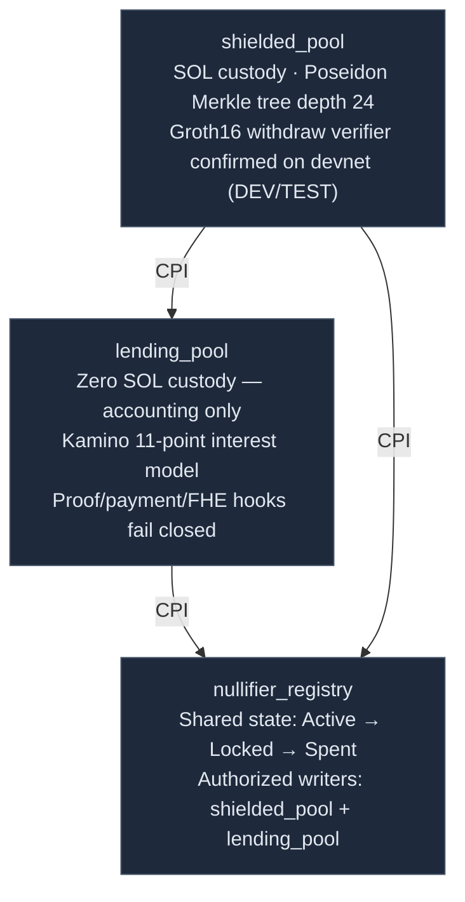

# ShieldLend — Privacy-First Lending Protocol on Solana

A zero-knowledge, privacy-preserving lending protocol design for Solana.

Current local implementation is a pre-alpha scaffold. All three Anchor programs
are deployed on devnet. On-chain Groth16 BN254 verification is confirmed for
the withdraw path (DEV/TEST trusted setup only). External privacy rails (IKA,
MagicBlock PER/Private Payments, Umbra, Encrypt/FHE) are not yet wired.

Built for the **Colosseum Frontier Hackathon 2026**.

---

## The Problem

On-chain lending has a fundamental privacy problem — and it is not just about hiding amounts.

Every interaction with a lending protocol creates a permanent, public record that an observer can use to build a profile of a user:

| Observable data | What it reveals |
|---|---|
| Deposit transaction | Depositor's wallet, amount, and timing |
| Loan disbursement | Borrower's wallet, loan size, and collateral |
| Repayment transaction | Confirmation that a wallet is a borrower |
| Withdrawal | Links the depositor's wallet to a withdrawal destination |

This matters for individuals who want financial privacy, for institutions that cannot reveal their treasury positions on-chain, and for anyone whose on-chain credit history should not be public record.

Existing privacy tools address one layer at a time: mixers hide amounts but not lending state; stealth addresses hide destinations but not deposits; ZK proofs hide which commitment was spent but not who submitted the transaction. ShieldLend combines these layers across the full transaction lifecycle.

---

## Design Philosophy

Privacy in DeFi is not a feature — it is a stack.

ShieldLend's target architecture applies sequential protections across the
transaction lifecycle. Each protection closes a specific gap that no other
component addresses. These layers are not all live in the current local build:

- **Entry protection** (MagicBlock PER + VRF): Deposits execute inside an Intel TDX enclave. Multiple users' deposits batch before any commitment reaches the Merkle tree — no observer can link a wallet to a specific commitment. VRF generates dummy commitments that are indistinguishable from real ones, permanently expanding the anonymity set for all future ring proofs.

- **Relay protection** (IKA dWallet): Every on-chain operation — deposit, withdrawal, borrow, repay — is submitted by the IKA relay wallet, not the user's wallet. The relay is a 2PC-MPC dWallet: no single key exists. Both the user and the IKA MPC network must participate to authorize any relay operation. All exits (withdrawals and borrow disbursements) route through the same relay → PER batch → stealth path, making their type indistinguishable on-chain.

- **State protection** (Encrypt FHE): Oracle price feeds for health factor computation are submitted as FHE ciphertexts. MEV bots cannot compute liquidation trigger conditions from encrypted mempool data. Aggregate solvency is tracked through encrypted collateral coverage and public/bucketed debt accounting without revealing individual collateral positions.

- **Payment protection** (MagicBlock Private Payments): Repayments settle through a private SPL/WSOL payment path. The LendingPool verifies a receipt bound to `loanId`, `nullifierHash`, and `outstanding_balance`, so collateral can unlock without publishing the repayment transfer graph.

- **Exit protection** (Umbra SDK): Every output — withdrawal destinations and loan disbursements — routes to a one-time Umbra stealth address. Each address is derived via ECDH from the recipient's published meta-address, has zero prior chain history, and is abandoned after use.

---

## Current Build Status

> **Pre-alpha devnet build — reconciled 2026-05-07 (C2H complete).**
> Local source state is authoritative. Do not use stale GitHub-rendered README
> snapshots for status. See [`docs/IMPLEMENTATION_STATUS.md`](docs/IMPLEMENTATION_STATUS.md)
> for the full ledger.

| Component | Status | Notes |
|---|---|---|
| Anchor program IDs | Synced — all three `declare_id!`, `Anchor.toml`, `contracts.ts` | Confirmed by `anchor keys list` and devnet deployment |
| Anchor SBF build | Passes with `anchor build --no-idl` | `.so` files in `target/deploy/`; zero stack-frame errors |
| Full Anchor IDL build | Blocked | Anchor/proc-macro2 compatibility issue; intentionally out of scope |
| Devnet deployment | **All three deployed** | `nullifier_registry`, `shielded_pool`, `lending_pool` on devnet |
| Rust unit tests | Active | `cargo test --workspace` passes: 47 tests |
| Frontend checks | Active | Typecheck and production build pass |
| `withdraw_ring.circom` | Compiles | Browser WASM + DEV/TEST zkey + vkey generated and hashed |
| `collateral_ring.circom` | Compiles | Browser WASM + DEV/TEST zkey + vkey generated and hashed |
| `repay_ring.circom` | Compiles | Browser WASM + DEV/TEST zkey + vkey generated and hashed |
| DEV/TEST `.zkey` / `_vkey.json` | Generated | DEV/TEST only — not a production trusted setup |
| On-chain Groth16 verification (withdraw) | **Confirmed on devnet** | DEV/TEST trusted setup; 198,502 CU; full round-trip passed |
| On-chain Groth16 verification (borrow/repay) | Not yet verified | Verifier wired in program; end-to-end devnet test not run |
| External privacy rails | Not wired | IKA, PER, Private Payments, Umbra, Encrypt/FHE |
| Local note/history vault | Implemented | AES-256-GCM + HKDF, wallet-derived key |

---

## Protocol Selection

Every protocol in ShieldLend's stack was chosen to close a specific privacy gap that no other tool addressed. The design started from privacy requirements and worked backwards to protocols — not the other way around.

The component-to-protocol mapping tables below show this gap → choice relationship for every function in the protocol. For the full decision rationale (alternatives considered, tradeoffs evaluated), see [`docs/DESIGN_DECISIONS.md`](docs/DESIGN_DECISIONS.md).

---

## Architecture

### Programs

ShieldLend is three Anchor programs. All SOL stays in one place. The other two programs only keep state.



For the full transaction lifecycle -- how deposit connects to withdraw, borrow, repay, and liquidate -- see [`docs/VISUAL_FLOWS.md`](docs/VISUAL_FLOWS.md).

---

### Target Privacy Architecture

Each intended layer closes a different gap in the lending lifecycle. The
current implementation status for each layer is listed in the Privacy Status
table above.

| Layer | What it does | Why it is needed |
|---|---|---|
| IKA dWallet | Submits protocol actions without exposing the user's main wallet as signer. | Prevents deposit, withdraw, borrow, and repay instructions from becoming wallet-linked credit events. |
| MagicBlock PER | Batches deposits and exits inside a private execution environment. | Breaks timing correlation and makes withdrawal exits and borrow disbursement exits harder to classify. |
| Groth16 circuits | Prove note ownership, collateral validity, and repayment authority. | Lets the protocol enforce rules without revealing which note belongs to the user. |
| MagicBlock Private Payments | Settles repayments through a private payment receipt in Full Privacy mode. | A ZK proof alone cannot hide a normal public repayment transfer. |
| Encrypt FHE | Keeps oracle and health-factor computation encrypted until authorized reveal. | Protects liquidation-sensitive data from MEV and public health-factor surveillance. |
| Umbra | Gives each withdrawal or disbursement a fresh stealth receiving address. | Prevents outputs from landing directly in a known wallet. |
| NullifierRegistry | Tracks Active, Locked, and Spent note states. | Prevents double-spend and prevents collateral withdrawal during active loans. |

The canonical explanation of these flows is [`docs/VISUAL_FLOWS.md`](docs/VISUAL_FLOWS.md). The exact privacy guarantees, residual risks, and adversary model are in [`docs/PRIVACY_AND_THREAT_MODEL.md`](docs/PRIVACY_AND_THREAT_MODEL.md).

---

## Privacy Status

Current privacy status is implementation-status, not target-design status.
Anything marked "not live" must not be claimed in demos, submissions, or
external docs.

| Property or rail | Current local status | Live claim? |
|---|---|---|
| Local note vault encryption | Implemented | Yes, local-browser only |
| Local history encryption | Implemented | Yes, local-browser only |
| Fixed denominations | Implemented in `shielded_pool` | Yes, local program logic |
| Root history / offline tolerance | Implemented in `shielded_pool` | Yes, local program logic |
| Nullifier Active/Locked/Spent state machine | Implemented in `nullifier_registry` | Yes, local program logic |
| Withdraw/borrow/repay nullifier CPI paths | Scaffolded after fail-closed verifier gates | Not end-to-end |
| Circuit constraints | Compiled to R1CS/WASM | Not live proofs |
| Browser WASM artifacts | Generated and hashed | WASM only |
| IKA relay signer privacy | Not wired | No |
| IKA FutureSign | Not wired | No |
| MagicBlock PER batching | Not wired | No |
| MagicBlock VRF dummies | Not wired | No |
| MagicBlock Private Payments | Not wired | No |
| Umbra stealth exits | Not wired | No |
| Encrypt/FHE oracle or health computation | Not wired | No |
| On-chain Groth16 verification (withdraw) | Confirmed on devnet — DEV/TEST only | No — DEV/TEST trusted setup, not production |
| On-chain Groth16 verification (borrow/repay) | Wired in program; devnet end-to-end not yet run | No |
| Production trusted setup | Missing | No |
| Full private repayment | Not live | No |
| Full private withdraw flow | Devnet round-trip confirmed — DEV/TEST only | No — DEV/TEST only; privacy rails not wired |
| Full private borrow flow | Not end-to-end verified on devnet | No |

---

## Funds and Accounting

SOL flows:
- **Target deposit**: IKA relay -> ShieldedPool via PER batch.
- **Current deposit code**: direct wallet-signed frontend path; programs deployed on devnet.
- **Target withdraw**: ShieldedPool -> IKA relay -> PER exit batch -> Umbra stealth address.
- **Current withdraw code**: program path fails closed before proof verification.
- **Target borrow**: ShieldedPool -> IKA relay -> PER exit batch -> Umbra stealth address.
- **Current borrow code**: lending proof verifier fails closed before disbursement.
- **Target repay**: MagicBlock Private Payments receipt plus IKA-submitted proof.
- **Current repay code**: proof and private-payment verifiers fail closed.

---

## ZK Circuits

All three circuits compile locally. DEV/TEST browser WASM artifacts, zkeys, and
vkeys are generated and hashed. On-chain Groth16 BN254 verification is confirmed
on devnet for the withdraw path (DEV/TEST trusted setup only — not production).
Borrow and repay verifiers are wired in the programs but not yet exercised end-to-end.

| Circuit | Source status | Browser WASM | ZKey | VKey | On-chain status | Public signals |
|---|---|---|---|---|---|---|
| `withdraw_ring.circom` | Compiles | Generated | DEV/TEST | DEV/TEST | **Confirmed on devnet** (198,502 CU) | `denomination_out`, `ring[16]`, `nullifierHash`, `root` |
| `collateral_ring.circom` | Compiles | Generated | DEV/TEST | DEV/TEST | Wired; devnet end-to-end not run | `ring[16]`, `nullifierHash`, `root`, `borrowed`, `minRatioBps` |
| `repay_ring.circom` | Compiles | Generated | DEV/TEST | DEV/TEST | Wired; devnet end-to-end not run | `nullifierHash`, `loanId`, `outstandingBalance`, `settlementReceiptHash`, `repaymentVault`, `receiptBindingHash` |

Artifact boundaries:

- `circuits/artifact_manifest.json` records WASM, zkey, and vkey hashes.
- DEV/TEST zkeys and vkeys exist at `circuits/keys/`. Not a production trusted setup.
- DEV/TEST `.ptau`: `circuits/keys/dev_pot14_final.ptau` (SHA-256 `3838aee2...`).
- Local proof smoke tests passed for all three circuits.
- On-chain `groth16-solana` verification is confirmed for `withdraw_ring` on devnet (DEV/TEST only).

**Nullifier formula** (all circuits): `nullifierHash = Poseidon(nullifier, leaf_index, SHIELDED_POOL_PROGRAM_ID)`

- `leaf_index`: private input proving position in the Merkle tree — prevents re-insertion attacks
- `SHIELDED_POOL_PROGRAM_ID`: domain separator — prevents cross-contract nullifier correlation

**Root validation design**: the program retains 30 non-zero historical roots
(`ROOT_HISTORY_SIZE = 30`). On-chain Groth16 verification checks the submitted
root against this history. Confirmed working on devnet (C2H round-trip).

---

## Fixed Denominations

Deposits use fixed denominations (0.1 SOL, 1 SOL, 10 SOL). This is a requirement of the ZK circuit design: denomination is embedded in the commitment hash and is a public output of the withdrawal proof. Standardized denominations prevent amount-based correlation — every participant in a denomination pool looks identical on-chain.

| Denomination | Lamports |
|---|---|
| 0.1 SOL | 100,000,000 |
| 1 SOL | 1,000,000,000 |
| 10 SOL | 10,000,000,000 |

Loan amounts are public or bucketed. The borrow amount appears as a public input to the collateral ring circuit because the protocol must deterministically verify LTV, interest accrual, reserve accounting, and liquidation thresholds on-chain. This is amount metadata leakage, not identity linkage: the borrower wallet, collateral note, and disbursement destination remain unlinked when the relay, ring proof, PER exit batch, and Umbra path are used correctly.

---

## Target Protocol Solvency

The intended solvency design uses Encrypt FHE for oracle and health
computation. This is not live in the current local implementation.

**Target aggregate monitoring:** Oracle price feeds are submitted as Encrypt FHE
ciphertexts. Collateral values are computed homomorphically and summed without
decrypting individual positions:
```
total_collateral_value = Σ(FHE_price × denomination[i])   // FHE multiplication + addition
total_outstanding      = Σ(borrow_amount[i])               // plaintext sum — borrow amounts are public
```
Current status: Encrypt/FHE is scaffolded only. No encrypted oracle, health
computation, or threshold reveal is live.

**Targeted audit (on-demand):** For compliance disclosure of a specific loan, the user can export selected local history records, proof public signals, transaction signatures, receipt hashes, and optional Encrypt threshold evidence for collateral/health. Borrower identity is not revealed unless the user chooses to disclose it.

---

## Target Component -> Protocol Mapping

### ShieldedPool

| Function | Protocol | Why this protocol |
|---|---|---|
| Deposit batching + execution | MagicBlock PER (TDX enclave) | Intel TDX required to batch deposits without any party observing the deposit→commitment mapping |
| Exit batching (withdrawals + disbursements) | MagicBlock PER (same enclave) | Both withdrawal and borrow disbursement exits batch together — type indistinguishable on-chain |
| Anonymity set expansion | MagicBlock VRF | Dummy insertions must be cryptographically unbiasable; VRF provides per-shuffle on-chain verifiable randomness; carries forward into all future ring proofs |
| Withdrawal submission | IKA relay | User wallet would be the ring proof transaction signer if submitted directly — permanently linking wallet to 16 ring candidates; relay routing prevents this |
| Withdrawal authorization | groth16-solana | On-chain BN254 Groth16 verified on devnet (DEV/TEST trusted setup); 198,502 CU |
| Withdrawal recipient | Umbra SDK | One-time stealth address with zero prior history; Umbra SDK handles generation, key derivation |

### LendingPool

| Function | Protocol | Why this protocol |
|---|---|---|
| Interest rate model | Kamino klend fork | Poly-linear 11-point model from a $3.2B TVL production protocol; audited; Anchor-native |
| Collateral proof verification | groth16-solana | Target: LTV check is a circuit constraint and must verify on-chain before disbursement |
| Private repayment settlement | MagicBlock Private Payments | Repayment value can settle privately while LendingPool receives a receipt bound to the loan, vault, and outstanding balance |
| Repayment proof verification | groth16-solana | Target: repay proof binds the collateral nullifier to a valid private payment receipt before clearing the LoanAccount |
| Disbursement routing | IKA relay + PER | Disbursement exits same relay → PER → stealth path as withdrawals; indistinguishable on-chain |
| Disbursement signing | IKA dWallet | Co-signing requires program LTV validation AND IKA MPC network; no single operator key |
| Disbursement recipient | Umbra SDK | Same reason as withdrawals — fresh stealth address, borrower wallet never on-chain |
| Oracle MEV prevention | Encrypt FHE | Price feeds as FHE ciphertexts; health_factor computed homomorphically; MEV bots cannot read pending price updates |
| Aggregate solvency | Encrypt FHE | Homomorphic sum of encrypted collateral values; only aggregate coverage is revealed |
| Compliance disclosure | User-scoped disclosure packet + optional Encrypt threshold evidence | User exports selected records only; no protocol-wide viewing key or global deanonymization path |
| Liquidation pre-authorization | IKA FutureSign | Borrower consents at borrow time; neither borrower (cannot block) nor operator (cannot trigger without condition) has unilateral control |

---

## Target Operational Modes

ShieldLend is designed to have three operational modes that degrade gracefully
when external dependencies are unavailable. These modes are not live in the
current local implementation. Full documentation is in
[`docs/NOTE_LIFECYCLE.md`](docs/NOTE_LIFECYCLE.md).

| Mode | Activates when | Privacy level |
|---|---|---|
| **Full Privacy** (target default) | All dependencies operational | Target only: relay, ZK, PER, private payments, FHE, and Umbra active |
| **Degraded Privacy** | MagicBlock PER offline for `per_fallback_epoch_threshold` epochs | Target only: reduced temporal unlinking |
| **Emergency** | PER and IKA both offline (governance vote required) | Target only: user wallet appears on-chain as signer; fund recovery prioritized |

**Full Privacy target**: Deposit path runs through IKA relay -> MagicBlock PER
enclave -> ShieldedPool batch. Borrow and withdrawal exits route through PER ->
Umbra stealth. Repayments settle through MagicBlock Private Payments with
receipt binding.

**Degraded Privacy target**: PER or private payment support is bypassed.
Deposits and exits go directly relay -> ShieldedPool without batching, or
repayment uses a normal relay transfer. Timing correlation and repayment amount
leakage become possible.

**Emergency target**: Both PER and IKA are unavailable.
`emergency_withdraw(ring_proof)` releases SOL directly to the user's own wallet.
This mode exists solely to guarantee fund recovery; it is a last resort and
requires a multi-sig governance vote with time-lock to activate.

---

## Tech Stack

**On-Chain / Current**
- Anchor 0.30.1 (Rust smart contracts)
- Three local Anchor programs: `shielded_pool`, `lending_pool`, `nullifier_registry`
- Kamino-style 11-point interest model logic

**On-Chain / Planned**
- groth16-solana (ZK proof verification, BN254 native syscalls, Light Protocol Labs)
- MagicBlock PER macros — `#[ephemeral]`, `#[delegate]`, `#[commit]` (planned)
- MagicBlock VRF SDK (planned)
- MagicBlock Private Payments / Private SPL token API (planned)
- IKA dWallet Anchor CPI — `ika-dwallet-anchor` (planned; real adapter first, labeled fallback only if unavailable)
- Encrypt FHE Anchor integration — `encrypt-anchor` (planned; real adapter first, labeled fallback only if unavailable)
- Poseidon hash (matching circuits)

**Off-Chain / Client**
- snarkjs 0.7.6 (browser proof generation path; blocked until zkeys exist)
- Circom (withdraw_ring, collateral_ring, repay_ring)
- Umbra SDK integration (planned)
- AES-256-GCM + HKDF (client-side note vault, from wallet signature)
- Next.js 15 + React 19
- @solana/web3.js

---

## Repository Structure

### Current (as of May 2026)

> Anchor workspace, programs, circuits, generated artifacts, test scaffolds, and
> frontend MVP shell. `anchor build --no-idl` passes; `.so` files in
> `target/deploy/`. All three programs deployed on devnet. DEV/TEST zkeys,
> vkeys, and Groth16 on-chain withdraw verification confirmed. Production trusted
> setup and external privacy rails are not yet in place.

```
shieldlend-solana/
├── Anchor.toml                 # workspace config; cluster = localnet
├── Cargo.toml                  # root Rust workspace
├── package.json                # root scripts (check:env, test:programs, build:frontend, circuits:compile)
├── circuits/
│   ├── withdraw_ring.circom    # K=16 ring + depth-24 Merkle; nullifier formula updated
│   ├── collateral_ring.circom  # K=16 ring + LTV in-circuit; nullifier formula updated
│   ├── repay_ring.circom       # nullifier knowledge + receipt binding; compiles
│   ├── artifact_manifest.json  # generated WASM hashes; zkey/vkey hashes are null
│   └── CEREMONY.md             # trusted setup / zkey blocker status
├── programs/                   # all three programs compiled + deployed on devnet
│   ├── shielded_pool/src/lib.rs
│   ├── lending_pool/src/lib.rs
│   └── nullifier_registry/src/lib.rs
├── tests/                      # Anchor test scaffolds (not full integration tests)
│   ├── shielded_pool.ts
│   ├── lending_pool.ts
│   └── nullifier_registry.ts
├── scripts/
│   └── check-env.mjs           # validates CLI tools + env vars
├── docs/
│   ├── architecture.md
│   ├── DESIGN_DECISIONS.md
│   ├── HACKATHON.md
│   ├── IMPLEMENTATION_PLAN.md
│   ├── NOTE_LIFECYCLE.md
│   ├── PITCH_DECK.md
│   ├── PRIVACY_AND_THREAT_MODEL.md
│   ├── RESEARCH_REPORT.md
│   └── VISUAL_FLOWS.md
├── frontend/
│   ├── public/circuits/
│   │   ├── withdraw_ring.wasm
│   │   ├── collateral_ring.wasm
│   │   └── repay_ring.wasm
│   └── src/
│       ├── app/
│       │   ├── api/integrations/
│       │   │   ├── encrypt/    # liquidation-reveal + status endpoints (pre-alpha stub)
│       │   │   └── ika/        # future-sign + status endpoints (pre-alpha stub)
│       │   └── page.tsx        # wallet connect + deposit flow shell
│       └── lib/
│           ├── circuits.ts         # snarkjs Groth16 proof generation
│           ├── contracts.ts        # stale program IDs; needs code follow-up
│           ├── noteStorage.ts      # AES-256-GCM note vault
│           ├── solanaClient.ts     # wallet / RPC / program ID boundaries
│           ├── protocolAdapters.ts # IKA / Encrypt / MagicBlock adapter stubs
│           └── prealphaIntegrations.ts  # pre-alpha status + fallback logic
└── README.md
```

### Planned (target state after Phase 1–4)

```
shieldlend-solana/
├── programs/
│   ├── shielded_pool/          # deposit, withdraw, Merkle tree, VRF integration
│   ├── lending_pool/           # Kamino klend fork + IKA + Encrypt FHE wiring
│   └── nullifier_registry/     # PDA nullifier set
├── circuits/
│   ├── withdraw_ring.circom    # updated with leaf_index nullifier formula
│   ├── collateral_ring.circom  # updated with leaf_index nullifier formula
│   ├── repay_ring.circom       # new: nullifier knowledge + private payment receipt binding
│   └── keys/                   # .zkey + .vkey.json for all three circuits
├── tests/
│   ├── shielded_pool.ts
│   ├── lending_pool.ts
│   └── live-test.mjs           # E2E devnet
├── frontend/
│   ├── app/
│   │   └── api/
│   │       ├── ika/route.ts    # IKA dWallet approve_message endpoint
│   │       └── per/route.ts    # MagicBlock PER deposit + exit endpoint
│   ├── lib/
│   │   ├── circuits.ts
│   │   ├── umbra.ts            # Umbra SDK integration
│   │   ├── encrypt.ts          # Encrypt FHE ciphertext interaction
│   │   └── noteStorage.ts
│   └── components/
│       ├── DepositForm.tsx
│       ├── WithdrawForm.tsx
│       ├── BorrowForm.tsx
│       └── RepayForm.tsx
├── docs/
│   └── (architecture, privacy/threat model, lifecycle, decisions, implementation plan, visual flows)
├── Anchor.toml
├── Cargo.toml
├── package.json
└── README.md
```

---

## Pre-Alpha Status

Several target protocols are pre-alpha, gated, or not wired in this repo.
Hackathon implementation targets real protocol adapters first. If a dependency
is unavailable, fallback adapters must be clearly labeled and the UI/docs must
reduce the relevant privacy claim for that mode. Production deployments require
mainnet availability.

| Protocol | Current repo status | External/devnet status note | Production path |
|---|---|---|---|
| IKA dWallet | SDK/status scaffolding only; relay not wired | Pre-alpha / gated devnet | IKA Solana mainnet |
| Encrypt FHE | SDK/status scaffolding only; FHE health not wired | Pre-alpha / gated devnet | Encrypt mainnet |
| MagicBlock PER + Private Payments | Not wired; Private Payments URL absent by default | Devnet access required | MagicBlock PER/private payments mainnet |
| groth16-solana | Not added/wired in programs | Target verifier path | BN254 syscalls live since Solana 1.18.x |
| Umbra SDK | Not wired in current frontend flow | Network/config not set locally | Production integration after code follow-up |

---

## Hackathon Tracks

| Track | Sponsor | Target implementation |
|---|---|---|
| IKA + Encrypt Frontier | Superteam | Target: dWallet relay authorization, FutureSign liquidation consent, encrypted oracle/health computation, aggregate solvency |
| Colosseum Privacy Track | MagicBlock | Target: PER deposit batching, PER exit batching, VRF dummy insertion, private repayment settlement |
| Umbra Side Track | Frontier | Target: Umbra SDK for output stealth addresses, exit hygiene, and optional disclosure patterns |

Each track covers a distinct privacy layer — entry execution, transaction authorization, private repayment settlement, encrypted state, and exit address hygiene — with no overlap between them. For full track-by-track integration details and non-overlap justification, see [`docs/HACKATHON.md`](docs/HACKATHON.md).

---

## Architecture Inspirations

ShieldLend builds on proven patterns from production privacy protocols -- historical root ring buffers (Railgun, Tornado Cash), position-dependent nullifiers (Penumbra), app-siloed nullifier domains (Aztec), and async FHE liquidation patterns adapted to Solana's Anchor/PDA model. Two patterns are original to this design: VRF dummy indistinguishability and the unified exit path that makes withdrawal and borrow disbursement structurally identical on-chain.

Full competitive analysis, attribution table, and protocol comparisons: [`docs/RESEARCH_REPORT.md`](docs/RESEARCH_REPORT.md).

---

## Documentation

| Document | Contents |
|---|---|
| [`docs/IMPLEMENTATION_STATUS.md`](docs/IMPLEMENTATION_STATUS.md) | Canonical local implementation ledger and claim boundaries |
| [`docs/architecture.md`](docs/architecture.md) | Program design, CPI flows, account model, data structures |
| [`docs/PRIVACY_AND_THREAT_MODEL.md`](docs/PRIVACY_AND_THREAT_MODEL.md) | Privacy guarantees, accepted disclosures, adversaries, attack scenarios, trust assumptions |
| [`docs/DESIGN_DECISIONS.md`](docs/DESIGN_DECISIONS.md) | ADR-style rationale for every protocol and architecture choice |
| [`docs/NOTE_LIFECYCLE.md`](docs/NOTE_LIFECYCLE.md) | Note state machine, LoanAccount lifecycle, protocol parameters, operational modes |
| [`docs/IMPLEMENTATION_PLAN.md`](docs/IMPLEMENTATION_PLAN.md) | Approved build plan, phase order, contracts, circuits, imports, tests, visuals |
| [`docs/VISUAL_FLOWS.md`](docs/VISUAL_FLOWS.md) | Clear investor/judge-facing architecture and privacy-flow diagrams |
| [`docs/PITCH_DECK.md`](docs/PITCH_DECK.md) | Slide-by-slide pitch narrative and product storytelling outline |
| [`docs/HACKATHON.md`](docs/HACKATHON.md) | Track-by-track eligibility, submission narratives, required integrations |
| [`docs/RESEARCH_REPORT.md`](docs/RESEARCH_REPORT.md) | Full competitive analysis: competitor profiles, production protocol research, vulnerability findings |

---

## Getting Started

> **Note**: Local build/test commands are runnable, but deployment and full
> privacy flows are not. Do not run full `anchor build` with IDL until the
> Anchor/proc-macro2 compatibility blocker is resolved.

```bash
# Solana CLI + Anchor prerequisites
solana-install init 1.18.x
anchor --version  # expected: 0.30.1

# Install dependencies from the workspace root
npm install

# Local validation
cargo fmt --all -- --check
cargo test --workspace
npm run typecheck:frontend
npm run build:frontend
anchor build --no-idl

# Join MagicBlock Discord for PER devnet endpoint access
# https://discord.com/invite/MBkdC3gxcv

# Configure environment before any external integration work
cp frontend/.env.example frontend/.env.local
# Set: IKA_DWALLET_*, MAGICBLOCK_PER_ENDPOINT, UMBRA_*, SOLANA_RPC_URL
```
