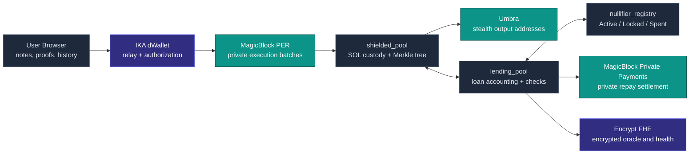
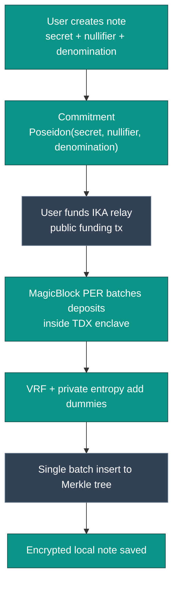
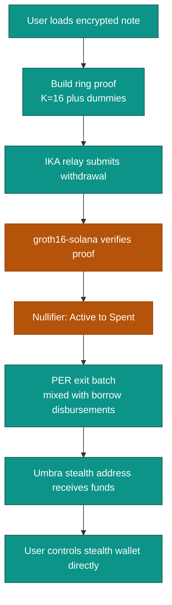
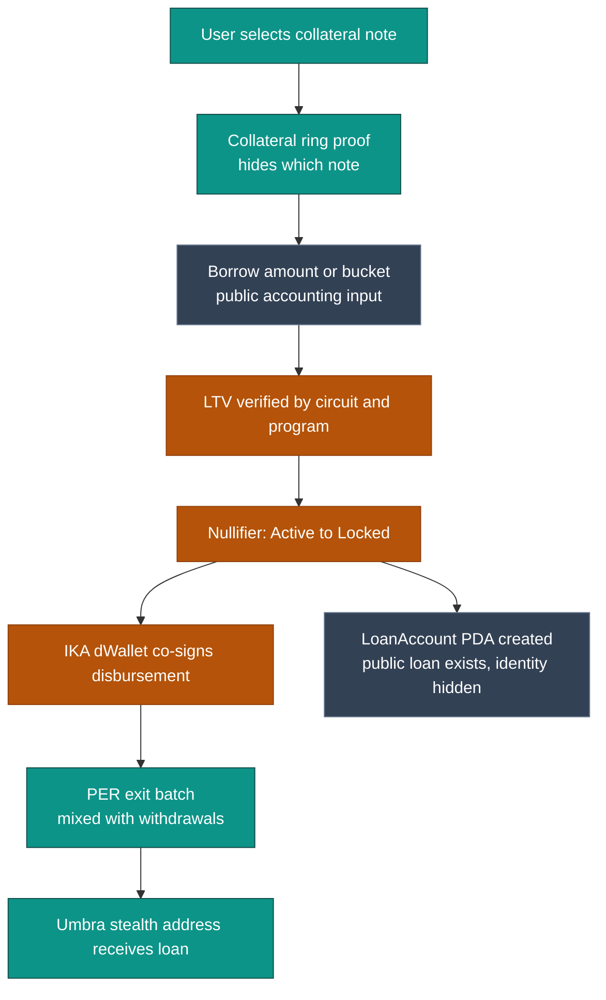
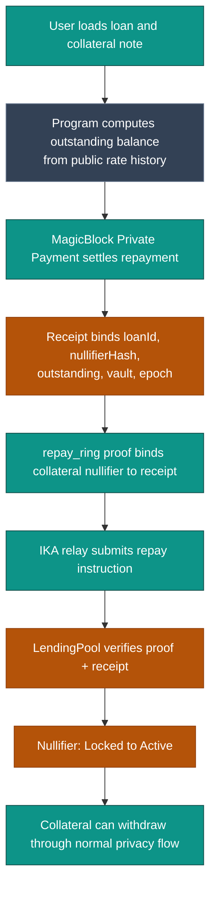
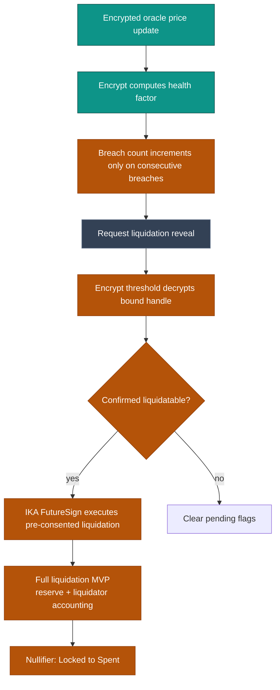
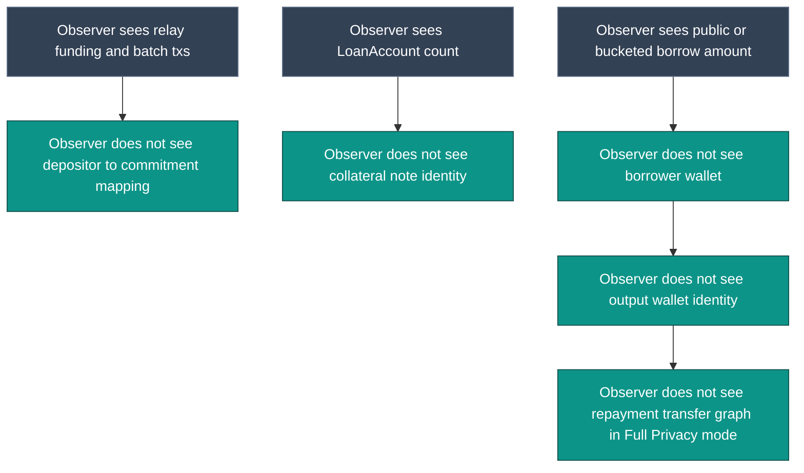

# ShieldLend Solana — Visual Architecture Flows

These diagrams are written for mentors, judges, investors, and implementation contributors. They show what each privacy layer does and where lending safety checks happen.

---

## 1. Protocol Role Map

---

## 2. Deposit Privacy Flow

What this proves visually: the public funding transaction is not one-to-one with a final commitment.

---

## 3. Withdrawal Privacy Flow

Key point: the ring proof hides which commitment was spent, the relay hides who submitted the proof, and Umbra hides where funds went.

---

## 4. Borrow Privacy and Lending Safety Flow

Key point: public borrow amount supports solvency and liquidation, but does not reveal the borrower wallet or original depositor.

---

## 5. Private Repayment Flow

If private payments are unavailable, repayment can still hide identity through relay submission, but amount privacy is not claimed.

---

## 6. Liquidation and Bad-Debt Control

The MVP avoids partial liquidation to reduce bad-debt and accounting risk.

---

## 7. User History and Scoped Disclosure

There is no protocol-wide viewing key. Disclosure is user-controlled and scoped.

---

## 8. Observer View

