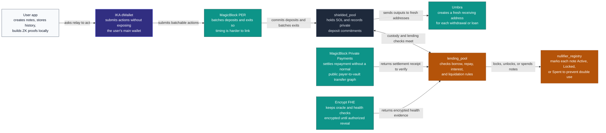
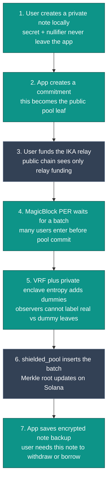
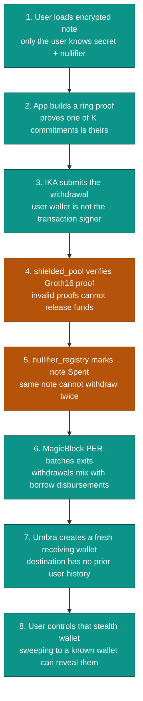
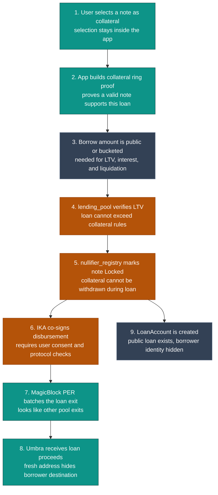
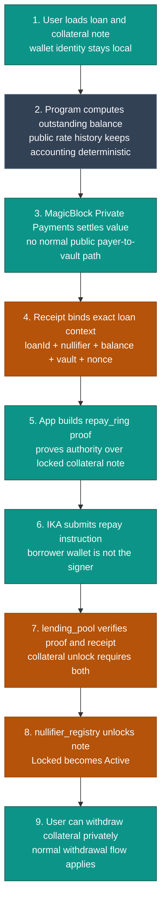
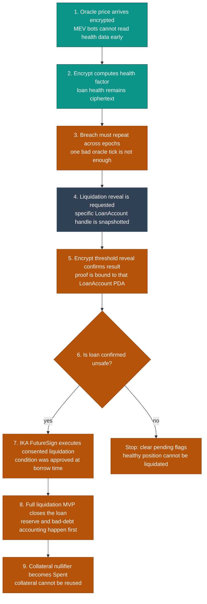
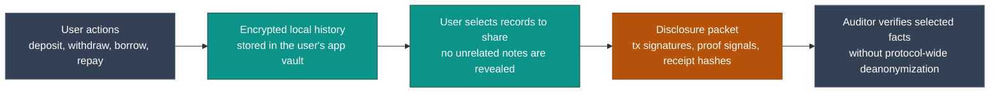
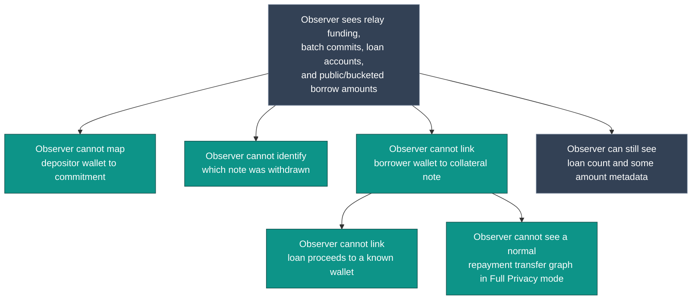

# ShieldLend Solana - Visual Architecture Flows

This file is the plain-English visual explanation of ShieldLend. It is written for judges, mentors, investors, and technical reviewers who need to understand not just which protocols are used, but why each protocol is necessary.

Each flow answers five questions:

1. What is the user trying to do?
2. Which part of ShieldLend checks safety?
3. Which external protocol adds privacy or authorization?
4. What does the public chain still see?
5. What link is broken for observers?

## 1. Protocol Role Map

Purpose: show why each protocol exists in the stack. No protocol is included only for branding; each one closes a separate privacy, safety, or authorization gap.

What this means: ShieldLend separates responsibilities. ZK proves note ownership, IKA prevents the user's wallet from becoming the protocol signer, MagicBlock hides timing and repayment settlement, Umbra hides output addresses, Encrypt hides liquidation-sensitive data, and the Solana programs enforce lending safety.

## 2. How A Private Deposit Works

Purpose: let a user fund the pool without letting observers map the funding wallet to a specific Merkle commitment.

What the chain sees: a relay was funded, then a batch of commitments was inserted.

What privacy is achieved: the chain does not learn which user funding transaction created which commitment. Dummies also make future rings harder to analyze.

What remains verifiable: the pool has received SOL, the Merkle root updated, and each later spend must prove membership in that tree.

## 3. How A Private Withdrawal Works

Purpose: let a user withdraw a note without linking the withdrawal to the original deposit or to a known wallet.

What the chain sees: relay-submitted proof verification, a nullifier marked spent, and a stealth address receiving funds.

What privacy is achieved: the ring hides which commitment was spent, IKA hides which wallet submitted the proof, PER makes exit type harder to classify, and Umbra hides the user's known receiving wallet.

What remains verifiable: the proof is valid, the note was not already spent, and only the fixed denomination is released.

## 4. How Borrowing Works Without Revealing Collateral Identity

Purpose: let a user borrow against a shielded note while keeping the collateral note and borrower wallet unlinked.

What the chain sees: a public or bucketed borrow amount, a LoanAccount PDA, and a locked nullifier.

What privacy is achieved: observers cannot tell which note is collateral, which wallet owns it, or which known address received the loan.

What remains verifiable: the protocol can still enforce LTV, interest, reserves, liquidation, and bad-debt controls.

## 5. How Private Repayment Works

Purpose: repay a loan and unlock collateral without revealing the borrower's wallet, and in Full Privacy mode without exposing a normal public repayment transfer graph.

What the chain sees: a loan is repaid and a locked nullifier becomes active again.

What privacy is achieved: the repay transaction does not reveal the borrower's wallet. In Full Privacy mode, MagicBlock Private Payments also avoids a normal visible repayment transfer graph.

What remains verifiable: LendingPool recomputes the outstanding balance, verifies the payment receipt, verifies the ZK proof, and only then unlocks collateral.

Degraded mode: if private payments are unavailable, relay repayment can still hide identity, but repayment amount privacy is not claimed.

## 6. How Liquidation Protects The Protocol

Purpose: prevent bad debt without publicly exposing every borrower's health factor.

What the chain sees: liquidation requests and confirmations for LoanAccounts.

What privacy is achieved: observers do not get a live public feed of individual health factors or borrower wallets.

What remains verifiable: liquidation only executes after encrypted health computation, threshold confirmation, breach confirmation, and FutureSign conditions pass.

## 7. How User History And Disclosure Work

Purpose: give users records for accounting or compliance without giving the protocol a global viewing key.

What the user gets: usable transaction history and optional compliance exports.

What the protocol does not get: a user-indexed activity feed, a global viewing key, or a universal deanonymization path.

## 8. What A Third-Party Observer Can And Cannot Learn

Purpose: summarize the practical privacy result from the outside.

Final interpretation: ShieldLend does not make all protocol state invisible. It keeps enough state public for lending safety while breaking the links that create wallet-level credit surveillance.
